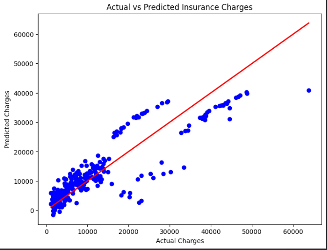

# Medical Insurance Charges Prediction using Multiple Linear Regression

## Objective

To develop a Multiple Linear Regression model that predicts medical insurance charges based on customer information such as age, sex, BMI, children, smoking status, and region.

---

## Dataset Link

https://www.kaggle.com/datasets/mirichoi0218/insurance

---

## Libraries Used

- Pandas
- NumPy
- Matplotlib
- Scikit-learn

---

## Methodology

1. Load the insurance dataset.
2. Explore numerical and categorical features.
3. Check for missing values.
4. Encode categorical variables.
5. Split data into training and testing sets (80:20).
6. Train a Multiple Linear Regression model.
7. Predict insurance charges.
8. Evaluate using MAE, MSE, and R² Score.
9. Visualize Actual vs Predicted Charges.

---

## Results

Example Results (may vary slightly):

- MAE: 4186.5
- MSE: 33596915.85
- R² Score: 0.78

The model demonstrates good predictive performance and captures the relationship between customer attributes and insurance charges.

### Actual vs Predicted Charges

---

## Conclusion

Multiple Linear Regression effectively predicts insurance charges using customer demographics and health-related features. Smoking status, age, and BMI are the most influential variables. Although the model performs well, it assumes linear relationships and may not capture complex patterns present in the dataset. More advanced machine learning algorithms can further improve prediction accuracy.
