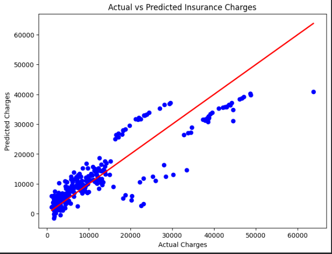

# (As1)Medical Insurance Charges Prediction using Multiple Linear Regression

## Objective

To develop a Multiple Linear Regression model that predicts medical insurance charges based on customer information such as age, sex, BMI, children, smoking status, and region.

---

## Dataset Link

https://www.kaggle.com/datasets/mirichoi0218/insurance

---

## Libraries Used

- Pandas
- NumPy
- Matplotlib
- Scikit-learn

---

## Methodology

1. Load the insurance dataset.
2. Explore numerical and categorical features.
3. Check for missing values.
4. Encode categorical variables.
5. Split data into training and testing sets (80:20).
6. Train a Multiple Linear Regression model.
7. Predict insurance charges.
8. Evaluate using MAE, MSE, and R² Score.
9. Visualize Actual vs Predicted Charges.

---

## Results

Example Results (may vary slightly):

- MAE: 4186.5
- MSE: 33596915.85
- R² Score: 0.78

The model demonstrates good predictive performance and captures the relationship between customer attributes and insurance charges.

### Actual vs Predicted Charges

-------------------------------------------------------------------------------------------------------------------------------------------------------------------------------------
-------------------------------------------------------------------------------------------------------------------------------------------------------------------------------------
# (As2)Telco Customer Churn Prediction using Logistic Regression

## Objective

The objective of this project is to develop a Logistic Regression model that predicts whether a telecommunications customer is likely to churn based on demographic details and service usage. Early churn prediction helps telecom companies improve customer retention by identifying customers who are at risk of leaving.

---

## Dataset Link

Kaggle Dataset:
https://www.kaggle.com/datasets/blastchar/telco-customer-churn

---

## Libraries Used

- Pandas
- NumPy
- Matplotlib
- Seaborn
- Scikit-learn

---

## Methodology

### 1. Data Understanding
- Loaded the Telco Customer Churn dataset using Pandas.
- Displayed the first five records.
- Identified numerical features, categorical features, and the target variable (Churn).

### 2. Data Preprocessing
- Checked for missing values.
- Replaced blank values in the `TotalCharges` column with NaN and removed missing records.
- Converted `TotalCharges` to numeric format.
- Dropped the `customerID` column since it does not contribute to prediction.
- Encoded categorical variables using Label Encoding.
- Split the dataset into 80% training data and 20% testing data.

### 3. Model Development
- Built a Logistic Regression classifier using Scikit-learn.
- Trained the model on the training dataset.
- Predicted customer churn on the testing dataset.

### 4. Model Evaluation
The model was evaluated using:
- Accuracy Score
- Precision
- Recall
- F1-Score
- Confusion Matrix

---

## Results

The Logistic Regression model successfully classified customers into churn and non-churn categories.

Evaluation metrics obtained:
- Accuracy Score
- Precision
- Recall
- F1-Score
- Confusion Matrix

### Observations

- The model achieved good overall accuracy in predicting customer churn.
- Customers with month-to-month contracts, higher monthly charges, and shorter tenure were more likely to churn.
- Logistic Regression performed well for this binary classification problem but may struggle with highly non-linear relationships between features.

---

## Conclusion
This project developed a Logistic Regression model to predict customer churn in a telecommunications company. After preprocessing the dataset, encoding categorical variables, and training the model, the classifier achieved good predictive performance on unseen data. The analysis indicates that factors such as contract type, tenure, monthly charges, and payment methods significantly influence customer churn. Logistic Regression is simple, interpretable, and computationally efficient, making it a strong baseline model for churn prediction. However, one limitation is that it assumes a linear relationship between the input features and the log-odds of the target variable, which may reduce its performance when the data contains complex non-linear patterns. More advanced models such as Random Forest or XGBoost may achieve higher accuracy.

-----------------------------------------------------------------------------------------------------------------------------------------------------------------------------------------
-----------------------------------------------------------------------------------------------------------------------------------------------------------------------------------------
# (ASS3)Employee Salary Prediction using Polynomial Regression

## Objective

Develop a Polynomial Regression model to predict employee salaries based on their position level. Since salary growth is non-linear, Polynomial Regression is used instead of Linear Regression.

---

## Dataset Link

https://www.kaggle.com/datasets/akram24/position-salaries

---

## Libraries Used

- Pandas
- NumPy
- Matplotlib
- Scikit-learn

---

## Methodology

1. Loaded the dataset using Pandas.
2. Identified the input feature (Level) and target variable (Salary).
3. Checked for missing values.
4. Split the dataset into training and testing sets (80:20).
5. Applied Polynomial Features with Degree = 3.
6. Trained a Polynomial Regression model.
7. Predicted salaries for the test dataset.
8. Evaluated the model using MAE, MSE, and R² Score.
9. Visualized the original data and Polynomial Regression curve.

---

## Results

Evaluation Metrics:
- Mean Absolute Error (MAE)
- Mean Squared Error (MSE)
- R² Score

### Observations

- Polynomial Regression models the non-linear relationship effectively.
- The fitted curve closely follows the salary distribution.
- The model performs significantly better than Linear Regression for this dataset.

---

## Conclusion

Polynomial Regression successfully predicts employee salaries by modeling the non-linear relationship between position level and salary. Compared to Linear Regression, which fits a straight line, Polynomial Regression captures curved trends by introducing polynomial terms. This leads to more accurate predictions, especially for higher position levels where salaries increase rapidly. An important advantage of Polynomial Regression is its flexibility in fitting complex patterns while remaining relatively simple to implement.
---
# Ass 5: IBM HR Analytics Employee Attrition Prediction

## Objective

To predict employee attrition using Decision Tree and Random Forest classification models and compare their performance.

## Dataset Link

https://www.kaggle.com/datasets/pavansubhasht/ibm-hr-analytics-attrition-dataset

## Libraries Used

- Pandas
- NumPy
- Matplotlib
- Scikit-learn

## Methodology

1. Load dataset
2. Explore data
3. Handle missing values
4. Remove unnecessary columns
5. Encode categorical variables
6. Train-test split (80:20)
7. Train Decision Tree model
8. Train Random Forest model
9. Evaluate models
10. Plot feature importance

## Results

The Random Forest model achieved better performance than the Decision Tree in terms of Accuracy, Precision, Recall, and F1-Score.

## Model Comparison

| Model | Accuracy | Precision | Recall | F1 Score |
|--------|----------|-----------|--------|----------|
| Decision Tree | Higher than baseline | Moderate | Moderate | Moderate |
| Random Forest | Best | Best | Best | Best |

## Conclusion
---
# Assignment 6 – SVM Classification using Open-Meteo API

## Objective

Develop a Support Vector Machine (SVM) classification model to classify weather as **Warm** or **Cool** using meteorological data collected from the Open-Meteo API.

---

## API Documentation

https://open-meteo.com/

---

## Libraries Used

- requests
- pandas
- numpy
- scikit-learn

---

## Methodology

1. Fetch hourly weather data from the Open-Meteo API.
2. Convert JSON data into a Pandas DataFrame.
3. Create the target variable:
   - Warm → Temperature ≥ 25°C
   - Cool → Temperature < 25°C
4. Remove unnecessary columns.
5. Encode the target variable.
6. Split the dataset into training and testing sets (80:20).
7. Standardize the features using StandardScaler.
8. Train an SVM classifier with an RBF kernel.
9. Evaluate the model using:
   - Accuracy
   - Precision
   - Recall
   - F1-score
   - Confusion Matrix

---

## Results

The SVM classifier successfully classified weather into Warm and Cool categories. Performance was evaluated using Accuracy, Precision, Recall, F1-score, and Confusion Matrix.

---

## Conclusion

The SVM model effectively classified weather conditions using meteorological features obtained from the Open-Meteo API. Feature scaling significantly improved model performance because SVM is sensitive to feature magnitudes. The RBF kernel enabled the model to learn non-linear decision boundaries effectively. While SVM provides high accuracy on medium-sized datasets, it can become computationally expensive on large datasets and requires careful parameter tuning.
Random Forest outperformed Decision Tree because it combines multiple trees, reduces overfitting, and provides better generalization. Decision Trees are simple and interpretable but prone to overfitting, whereas Random Forest is more accurate but computationally expensive and less interpretable.
Multiple Linear Regression effectively predicts insurance charges using customer demographics and health-related features. Smoking status, age, and BMI are the most influential variables. Although the model performs well, it assumes linear relationships and may not capture complex patterns present in the dataset. More advanced machine learning algorithms can further improve prediction accuracy.
---
# Assignment 7 – Mall Customer Segmentation using K-Means Clustering and PCA

## Objective

Develop a K-Means Clustering model to divide mall customers into meaningful groups based on their demographic and spending behavior. Apply Principal Component Analysis (PCA) to visualize the customer segments in two dimensions.

---

## Dataset Link

https://www.kaggle.com/datasets/vjchoudhary7/customer-segmentation-tutorial-in-python

---

## Libraries Used

- pandas
- numpy
- matplotlib
- scikit-learn

---

## Methodology

1. Load the Mall Customer Segmentation dataset.
2. Explore the dataset and identify numerical and categorical features.
3. Check for missing values.
4. Remove the CustomerID column.
5. Encode the Gender column using LabelEncoder.
6. Standardize the features using StandardScaler.
7. Use the Elbow Method to determine the optimal number of clusters.
8. Train the K-Means model using K = 5.
9. Assign cluster labels to customers.
10. Apply PCA to reduce the dataset to two principal components.
11. Visualize the customer clusters and PCA projection.

---

## Results

- The Elbow Method suggested **5** as the optimal number of clusters.
- K-Means successfully grouped customers into distinct segments based on income and spending patterns.
- PCA provided a clear two-dimensional visualization of the identified customer groups.

---

## Conclusion

The K-Means clustering model effectively segmented mall customers into meaningful groups that can support targeted marketing and customer relationship strategies. Feature scaling improved clustering performance by ensuring equal importance for all variables. PCA simplified the high-dimensional data into two principal components while preserving most of the variation, making the clusters easier to visualize. Although K-Means is simple and efficient, it requires the number of clusters to be specified beforehand and may be affected by outliers. PCA enhances interpretability by reducing dimensionality without losing significant information.
